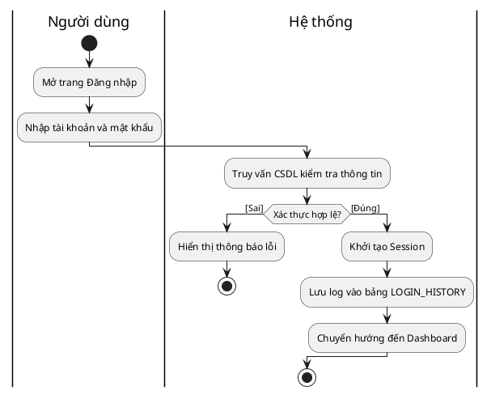
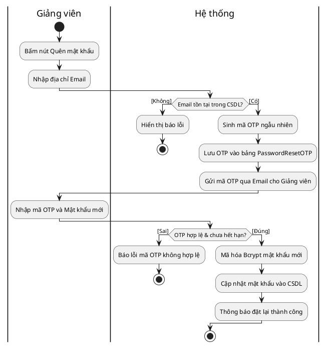
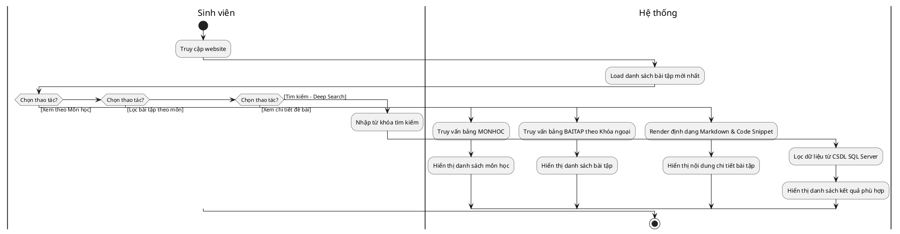
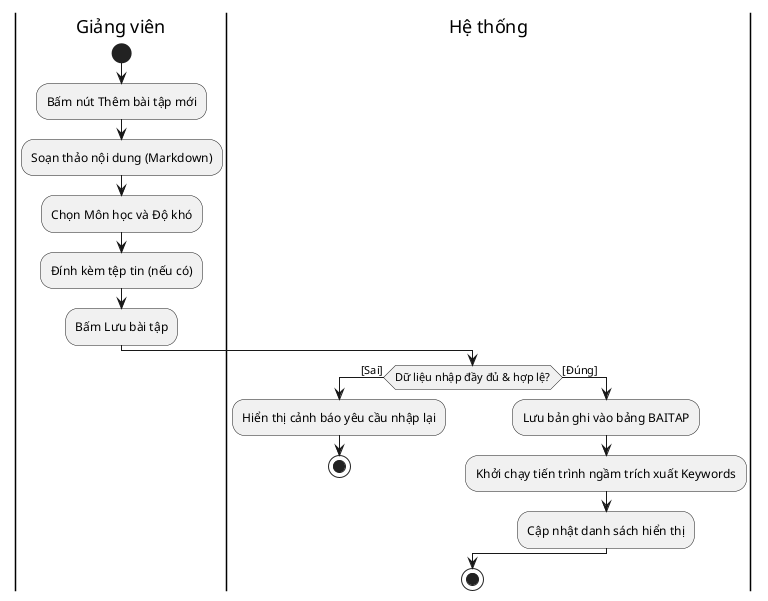
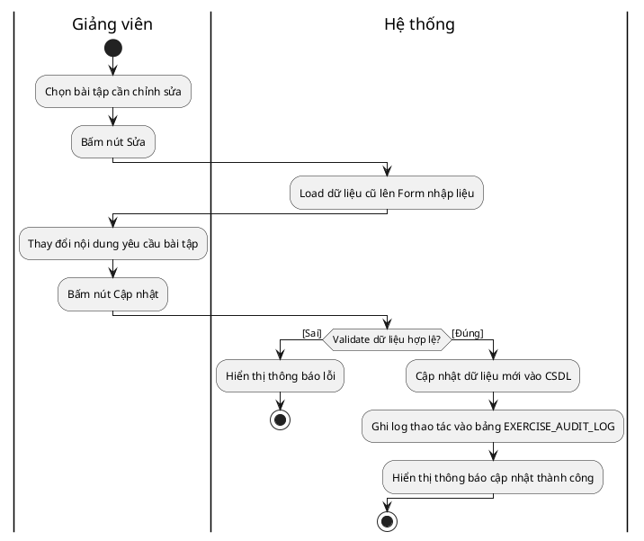
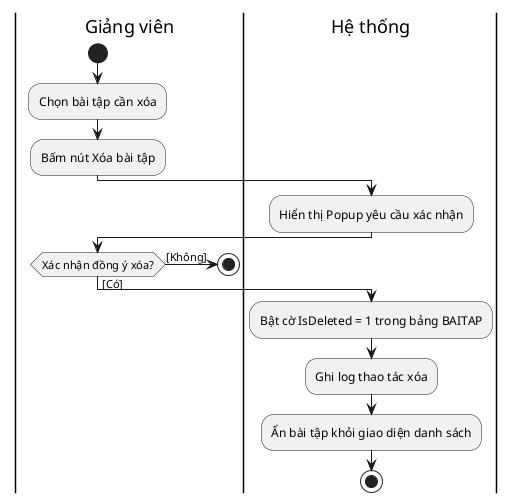
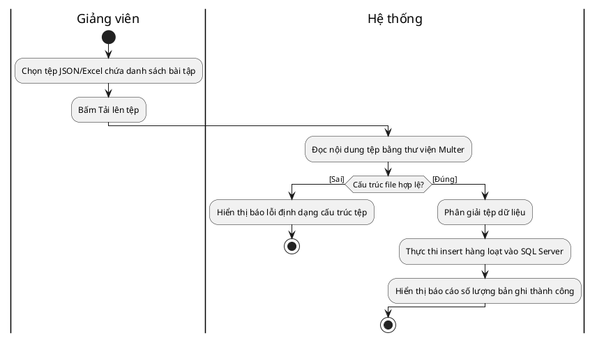
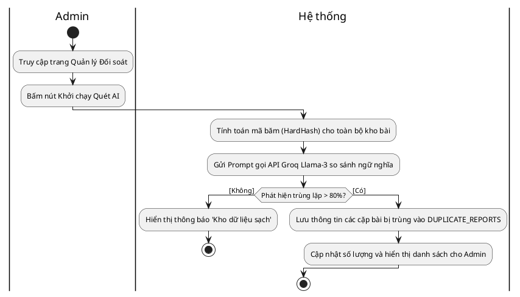
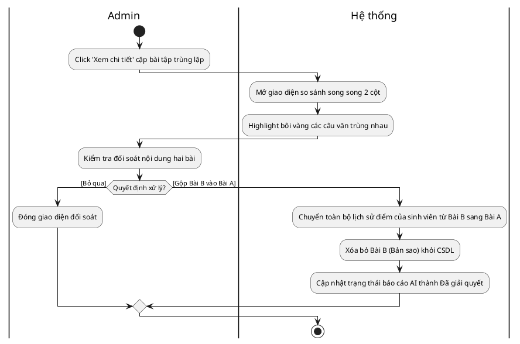

# BỘ CODE PLANTUML TẠO ACTIVITY DIAGRAM

*Hướng dẫn sử dụng: Copy từng đoạn code bắt đầu bằng `@startuml` đến `@enduml` và dán vào trang web **planttext.com** hoặc công cụ PlantUML (nếu tích hợp trong VS Code). Sơ đồ sẽ tự động sinh ra với định dạng phân làn (Swimlanes).*

---

## 1. Sơ đồ Đăng nhập hệ thống

## 2. Sơ đồ Khôi phục mật khẩu (OTP)

## 3. Sơ đồ Tra cứu và Xem bài tập (Sinh viên)

## 4. Sơ đồ Thêm bài tập mới

## 5. Sơ đồ Cập nhật (Sửa) bài tập

## 6. Sơ đồ Xóa bài tập (Xóa mềm - Soft Delete)

## 7. Sơ đồ Import Bài tập hàng loạt từ File

## 8. Sơ đồ Khởi chạy Quét AI Trùng lặp

## 9. Sơ đồ Đối soát và Gộp bài tập (Merge)

